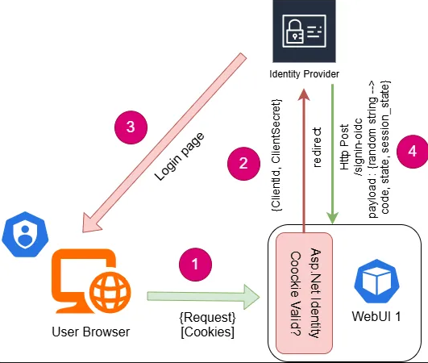
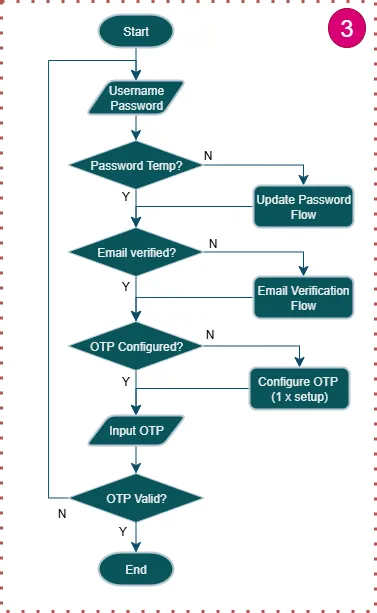

# Single Sing On (SSO) Using Keycloak

SSO is a common feature of web application. In New DNet we utilize identity provider platform called [Keycloak](https://www.keycloak.org/) to perform SSO. Keycloak has many ability to handle various authentication and authorization scenario but we only utilize it as identity provider. The main idea is New DNet has very custom user authorization and role management rule and it will more challenging if we rely on keycloak. Also, we are minimizing of being dependent to 3rd party platform.

Above is flow diagram of authenticating user to identity provider, keyloak. User, Web App, and Keycloak are communicating each other by using public domain. Here is the explanation

1. Login : By using web browser user hit app URL. If there’s no valid cookies (either there is no cookies or invalid/expired), App will return redirection to Keycloak URL which : “Hey keycloak, please handle this user want to log into Me, once authenticate, tell me again” ← this called as point no. 2
2. App send redirection response to user. While redirecting, app set some query string in the url :
    1. Client Id
    2. Redirect Url
    3. response type
    4. scope
    5. state
    6. nonce
    7. code challenge
    8. code challenge method
3. User browser open keycloak URL, New DNet login page is rendered here. User submit credential to keycloak here. Here is authentication flow run in keycloak
    1. username & password matching
    2. check email verification status
    3. check temp password state
    4. check password expiration
    5. MFA → TOTP Schema (FreeOtp, Google Authenticator, Microsoft Authenticator)
        
        Here is the floechart
        
        
        
4. Once authenticated, keycloak will redirect to app url (typically App home page). Keycloak call the /signin-oidc ulr back with datas:
    - code : code for app to exchange token (access_token, id_token, refresh_token)
    - state : random value sent from app in point 2.e, this is used to prevent CSRF

## Password Policy

Keycloak also has password policy configuration. 

- Expired password
- Minimum length
- Uppercase characters minimum required
- Lowercase characters minimum required
- Max Length
- Special character minimum required
- Digits minimum required
- Not recently used count
- Password blacklist
- Regex
- Not Username
- Not email
- Not contain username