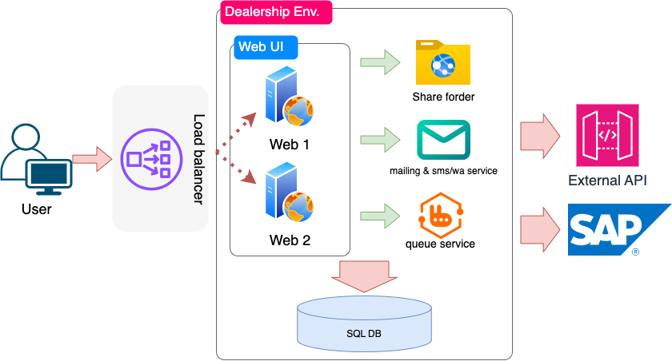
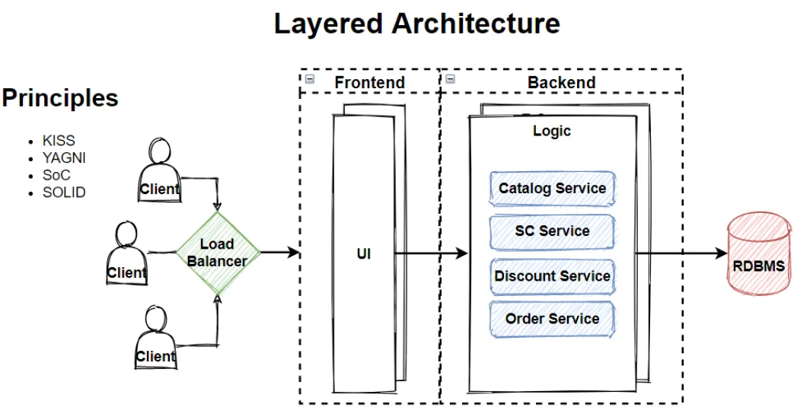
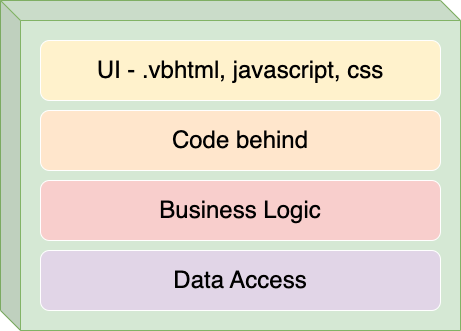

# Web Ui App

The main Web UI application used by both distributor and dealer. Total user of this web app is about 5000-6000 users with 3000’s user active simultaneously. Most of the process in the web app is transaction input, submission, and approval. The application has internal and external integration. Internal means the app integrate in intranet, the other system is develop and maintain by our self. External means otherwise. The external mostly 3rd party API (OCR, Mailing, vendor) and also it has ERP integration to SAP system (it has several ways to communicate with SAP, i will explain it separately).

## User to Web Server

User access the web app by public url, the public url bound on load balancer. the load balancer then will route to the lesser load between servers. The UI web app still state full app. It is storing user login state in session and some data in view state. not only user login, some data that require temporarily needed also stored in the server session. So therefore the load balancer will lock an user to a web server as long as the user session exist.

## Web Server Code Architecture

I join the company when the app is 15 years old, so i just continue the legacy sistem. I don’t really sure what kind of design pattern implemented, but from the project code and data/command flow inside the app, it uses n-layer architecture i guess.

source : [https://medium.com/design-microservices-architecture-with-patterns/layered-n-layer-architecture-e15ffdb7fa42](https://medium.com/design-microservices-architecture-with-patterns/layered-n-layer-architecture-e15ffdb7fa42)

In my web UI application, i split codes into parts like above :

For the first layer is UI build by html, javascript, and css. Since we using legacy microsoft [asp.net](http://asp.net) web form technology, every UI page bind with code behind file. The code behind mostly just orchestrating the behaviour of UI element, such as enable/disable button, show/hide label, etc. The business logic then will be processed in 3rd layer. For data access my app doesn’t use 3rd party ORM (object relational mapping), the former developer use Microsoft [ADO.Net](http://ADO.Net) and they manually map transaction from application to DB using SqlClient standard function only. Of course it is wrapped with interfaces and abstract classes to make code more effective and efficient.
