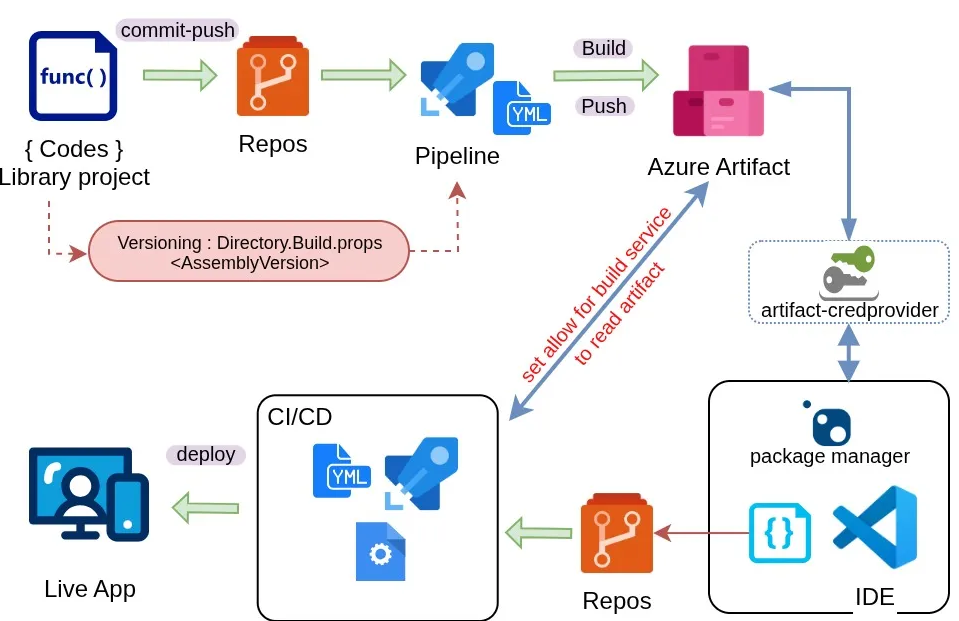

# Private NuGet in Azure Artifact

When you have sets of useful class lib project and other team want to utilize it, you have to start thinking to put it in accessible storage rather than re-distribute every time you update it. It is ok to store it in places like "limited-access drive" if you are the libs author, but it would be a pain for others who consume it. Above is a practice we are running using Azure DevOps:

- Use Azure pipelines to checkout code from repository, build it, set the version based on "centralized assembly version" stated in the code (if you prefer set the version separately, it is completely ok), and push it to Azure Artifact. In this case, we develop the library in C# and we can set version for entire projects by using Directory.Build.props. Make sure you already set pipeline permission to push artifact.
- At the library consumer side, some adjustment are needed. Since we set the artifact access limited, you need to make sure that your devops user has access to read the artifact, then make your "local development environment" able to read the artifact using artifact. (The using of azure artifact credential manager is explained [here](https://github.com/microsoft/artifacts-credprovider))
- we are also able to restore the library in out CI/CD pipeline. You need to add service connection if the artifact feed placed outside you organization. If your feed is in the same organization, you only need to grant permission to build agent user for accessing the feed.



Here is the pipeline example,  the following pipeline include auto detect assembly version stated in `Directory.Build.props` file. This script also add build number (auto generated by azure build) after the version, you can remove it if you don’t want to implement.

```yaml
trigger: none

pool:
  vmImage: ubuntu-22.04

steps:
# Install NuGet
- task: NuGetToolInstaller@1
  displayName: 'NuGet Tool Installer'

# Authenticate to the feed
- task: NuGetAuthenticate@1
  displayName: 'NuGet Authenticate'

# Extract versi from Directory.Build.props
- task: PowerShell@2
  displayName: 'Extract version from Directory.Build.props'
  inputs:
    targetType: inline
    script: |    
      [xml]$props = Get-Content "$(Build.SourcesDirectory)/Directory.Build.props"
      $assemblyVersion = $props.Project.PropertyGroup.AssemblyVersion
      $fileVersion = $props.Project.PropertyGroup.FileVersion
      $versionSuffix = $props.Project.PropertyGroup.VersionSuffix

      if ([string]::IsNullOrWhiteSpace($assemblyVersion)) { 
        Write-Error "AssemblyVersion not found in Directory.Build.props" 
        exit 1 
      }

      $packageVersion = $assemblyVersion
      if (-not [string]::IsNullOrWhiteSpace($versionSuffix)) {
        $packageVersion = "$assemblyVersion-$versionSuffix.$(Build.BuildId)"
      }

      Write-Host "##vso[task.setvariable variable=PackageVersion]$packageVersion"
      Write-Host "Resolved PackageVersion: $packageVersion"

# Pack nuget with verson from PackageVersion assigned in above script
- task: DotNetCoreCLI@2
  displayName: 'Pack NuGet packages'
  inputs:
    command: 'pack'
    packagesToPack: '**/*.csproj'
    includesymbols: true
    includesource: true
    versioningScheme: 'byEnvVar'
    versionEnvVar: 'PackageVersion'

# Push to feed
- task: NuGetCommand@2
  displayName: 'Push NuGet packages'
  inputs:
    command: 'push'
    packagesToPush: '$(Build.ArtifactStagingDirectory)/**/*.nupkg;!$(Build.ArtifactStagingDirectory)/**/*.symbols.nupkg'
    nuGetFeedType: 'internal'
    publishVstsFeed: '{your-feed-name}'
```