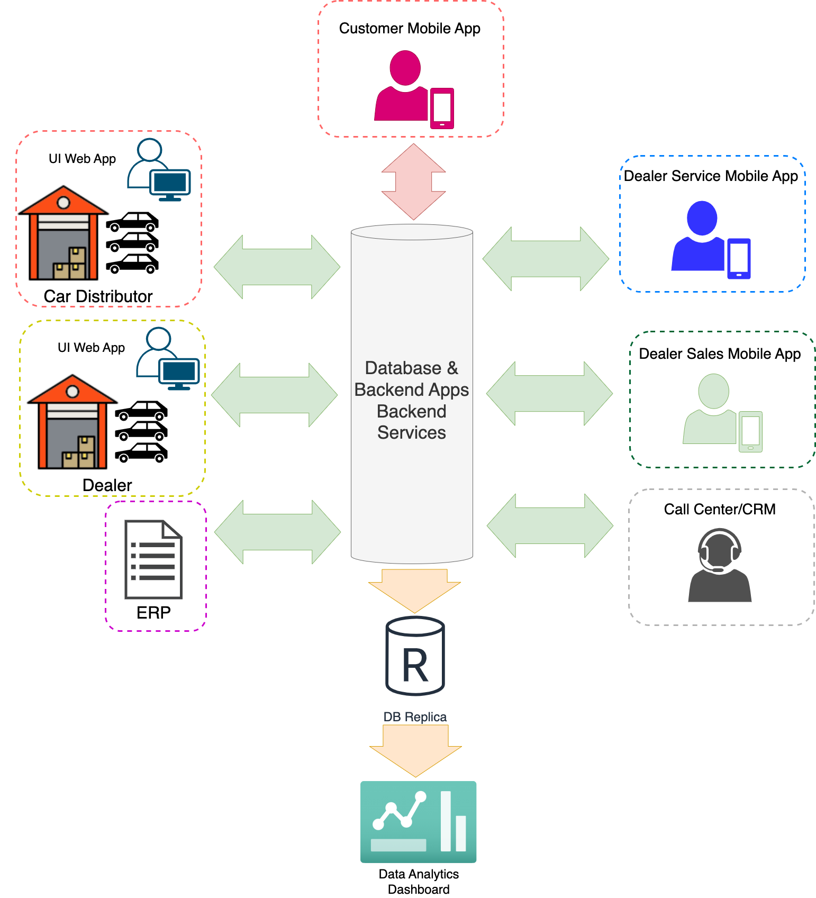

# Overview

Dealer network is web-based application is used to maintain transaction between one of car manufacture (in indonesia) and dealer (as direct seller to customer). This application built years ago, but the features is increasing and enhanced in era. Although the main application is web-based, there are several extension app that support the main UI app fulfil  the business need. in this article, i will explain what are the applications and services, how we (especially me) build and integrate, and also the pros and cons.

# The Business Needs

Every project will start from issue or solving something. Dealer Network born caused by transaction digitalisation need. Why the user need digitalisation? because they want to be effective and efficient in time, cost, and further more they need to increase the selling.

The business need to maintain their goods to sell, salesman, customer, promotion, pricing scenario, bonus, discount, etc. All mentioned thing will be maintained in Dealer Network applications.  For the first view, here is the high level of the business.

As shown, database is the mvp. It serve others application directly or by interface (Rest API mostly). Transaction started from maintaining master of car and also spare part in ERP application. It consist of car model, color, type, price, stock, assembly year, and all data related to the car.  Master data then synced to database, retrieved by the applications for transactional needs.

A web app is the main transaction tools for booth distributor/manufacturer and dealer. The distributor sell cars and spare part to dealer, dealer sell it to end customer. Dealer not only selling cars, also sell service (reparation, maintenance, part replacement). All the transaction (related to goods that come from distributor) should be tracked by the web app. All service also need to be recorded. Dealer need to tell distributor what service for, what problematic/damage part are, why the issue happened, so distributor can analyze what part should provided more, how is the prize, further, they can analyze to improve the car or part quality.

As a company, they need to keep close with customers, they need to hear customer voice, customer need,

The system has some surrounding app which support the main business flow. For example, the automotive manufacture need to know how the end customer response to their product, salesman (dealer), their service feedback, etc. So they need to blast survey timely via 3rd party messaging service. Another example, data is on of treasure of business, all data gathered from transaction, purchasing, service, processed in business intelligence, showed as information in dashboard, further, the information being one of important aspect for company to make decision or policy.

The detail explanation about others system will be available on next post 🙂

[Web UI Application](https://www.notion.so/Web-UI-Application-1955dd075dc780d491bfe835ea55b2e6?pvs=21)

[Web API](https://www.notion.so/Web-API-1a55dd075dc7807081c4f02439efe869?pvs=21)

[ERP Integration](https://www.notion.so/ERP-Integration-1a55dd075dc78000b0a7ec6e108cfd3d?pvs=21)

[Scheduler](https://www.notion.so/Scheduler-1b85dd075dc780d496c6f7af7a766edd?pvs=21)

[Windows Services](https://www.notion.so/Windows-Services-1b85dd075dc7805ca1faeb71b3556ac9?pvs=21)

[Queue Services](https://www.notion.so/Queue-Services-1b85dd075dc7807c8391fb7a33dd99bb?pvs=21)
